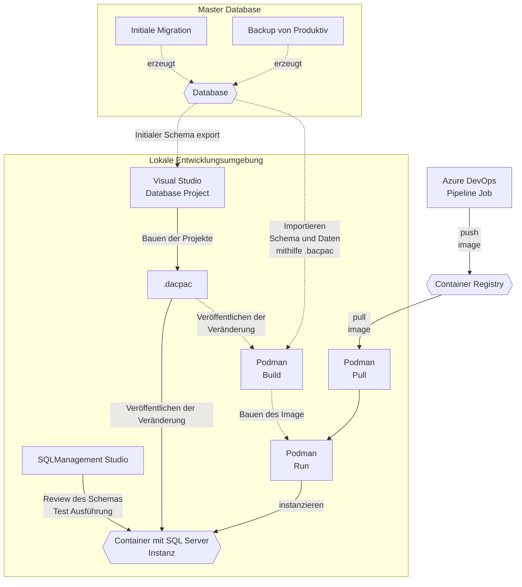
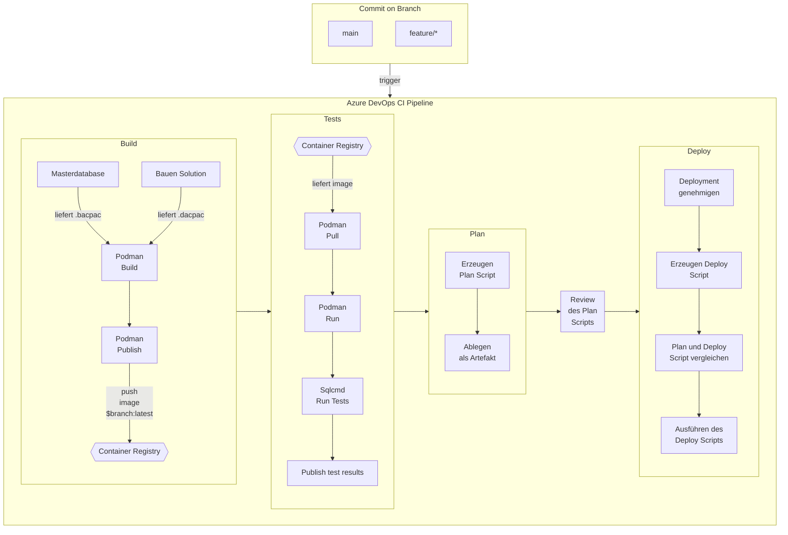

# Das Benutzen von Containern in Datenbankentwicklungsprojekten

## Einleitung

Datenbank Projekte stellen ein Entwicklungsteam hinsichtlich der Entwicklungsumgebung, der Programmierung und der Reproduzierbarkeit der Testumgebung, vor ganz eigene Probleme und Herausforderungen. Diese ähneln zwar der klassischen Softwareentwicklung, sind aufgrund der Abhängigkeit von dem größeren, komplexeren System, der Datenbank, schwerer zu lösen. 

Daneben existieren für die Datenbankentwicklung weniger allgemein gültige und verfügbare Entwicklungswerkzeuge, sondern eher proprietäre auf jeweils einen Datenbankhersteller zugeschnittene Lösungen, die jeweils auch nur einen Teilaspekt der Entwicklung unterstützen. Da diese oft, und auch in diesem Projekt, aus verschiedenen Quellen stammen, ist es eine ganz eigene Aufgabe, sie miteinander zum Sprechen und Funktionieren zu bringen. 

Dieses Projekt Evaluiert, wie die Entwicklung eines Datenbank Projektes aussehen kann und möchte mit Beispiel Code anderen Projekten dabei helfen erfolgreich zu sein. Dabei werden klassische und etablierte Praktiken wie: Trunk Based Development, Unit Testing, Continuous Integration und Containerisierung angewendet.

## Technologien

### Containerisierung der Datenbank

Während die meisten eben genannten Praktiken bekannt sein sollten, stellt die Containerisierung der Entwicklungsdatenbank etwas relativ Neues da und bekommt deshalb in diesem Projekt auch besondere Aufmerksamkeit.

In diesem Projekt, wird durch die Containerisierung, für jeden Entwicklungszweig jeweils eine eigene Datenbank erzeugt und für die Entwicklung bereitgestellt. Dabei ist der jeweilige Stand der Datenbank davon abhängig welche Änderungen auf dem jeweiligen Zweig an dem Schema, Daten- und Programmstand vorgenommen wurden.

Im Gegensatz zu einer lokal installieren Datenbank oder einen vom Team geteilten Server, soll die Containerisierung folgende Dinge vereinfachen:
- Zwischen den Zweigen und den jeweiligen Ständen der Datenbank zu wechseln, 
- In einer isolierten Umgebung die Auswirkungen von Veränderung zu untersuchen und diese ggf. wieder zu verwerfen, ohne dabei andere Teammitglieder zu stören,
- Durch Neustarten einer Instanz, einen reproduzierbaren Datenbankzustand für die Entwicklung und das manuelle und automatisierte Testen zu erhalten

### Podman als Docker Alternative

Docker ist der Veteran unter den Containertechnologien. Aufgrund von Lizenzkosten und des höheren Installations-, Konfigurationsaufwands und des Betriebes des Docker Daemons, wurde in diesem Projekt Podman eingesetzt. Podman verspricht durch eine sehr ähnliche Verwendung und Syntax für die Imageerzeugung eine niederschwellige, freie, schlanke Alternative zu Docker zu sein. Podman ist für Linux verfügbar.

Podman kann über das Advanced Packaging Tool (apt) installiert werden:

```bash
sudo apt-get -y update 
sudo apt-get -y install podman
```

Eine ausführliche Anleitung zur Benutzung von Podman gibt es in der [Podman Dokumentation](https://docs.podman.io/en/latest/index.html).

Sollte für die Entwicklung ein Windows System benutzt werden, muss zuerst das *Windows-Subsystem for Linux* (WSL) [installiert werden](https://learn.microsoft.com/de-de/windows/wsl/). In diesem kann dann `podman` installier und ausgeführt werden.

Da `podman` und `docker` in Bezug auf die Verwendung und den Inhalt der Containerdatei sehr ähnlich sind, wird eine `./Dockerfile`-Datei als Skript für die Image-Erstellung verwendet. Sie können Ihre Containerdatei aber auch einfach `./Containerfile` nennen (https://docs.podman.io/en/latest/markdown/podman-build.1.html#description).

Um die Erzeugung von Docker-Images zu beschleunigen, wurde eine zusätzliche `.dockerignore`-Datei erstellt. Diese schließt z. B. das Git-Repository und Build-Zwischendateien aus.

Innerhalb des Docker-Containers werden zusätzliche Tools wie unzip und SQLPackage installiert und nur für die Erstellung der Datenbank verwendet. Man kann argumentieren, dass diese Tools als Overhead mit dem Container ausgeliefert werden, ohne dass sie weiterverwendet werden.

In diesem Beispielprojekt wird dies getan, um alle Abhängigkeiten für die Image-Erstellung unter Source-Kontrolle, in einer geschlossenen Umgebung und innerhalb eines automatischen Prozesses zu halten. Dies ist eine Voraussetzung für eine saubere lokale Entwicklung des Containerfiles und der Build-Pipeline.


### SDKs zum Kompilieren von .dacpac's unter Linux

Visual Studio Datenbank Projekte werden zurzeit noch mithilfe des .NET Frameworks kompiliert. Damit ist das Kompilieren leider erst einmal auf Windows Systeme beschränkt, was wiederum Auswirkungen auf die Build Pipeline hat, da diese somit ebenfalls Windows benötigt. 

Bei den beiden Projekten [`MSBuild.Sdk.SqlProj`]() und [Microsoft.Build.Sql]() handelt es sich um SDKs, die das Kompilieren von `.sql`-Code zu `.dacpac` unter .NET und damit auch unter Linux ermöglichen. Da `podman` nur unter Linux läuft, kann die Build Pipeline einfacher gestaltet werden.

.NET stellt die neuere Welt im Microsoft Entwicklungsuniversum gegenüber dem .NET Framework dar. Ein weiterer Grund in diesem Projekt einmal die Möglichkeiten und Probleme, die sich ergeben zu evaluieren.

#### DacFx die Grundlage aller Werkzeuge

Beide SDKs basieren auf dem [DacFx](https://github.com/microsoft/DacFx) Framework von Microsoft. Dieses Framework stellt eine [Sammlung von Bibliotheken](https://www.nuget.org/packages/Microsoft.SqlServer.DACFx) zur Verfügung, die es ermöglichen Software für das Kompilieren, Anwenden und Benutzen der *Data-Tier Application packages* zu entwickeln. `SQLPackage` basiert ebenfalls auf diesem Framework.

Spannend ist Tatsache, dass es durch DacFx möglich ist, die Aktionen von `SQLPackage` mit eigener Funktionalität zu erweitern. Das Einbinden geschieht über einen Pluginmechanismus, bei dem die Plugins über das Argument [AdditionalDeploymentContributors](https://learn.microsoft.com/en-us/sql/tools/sqlpackage/sqlpackage-publish?view=sql-server-ver16#properties-specific-to-the-publish-action) angegeben werden. In den Plugins lassen sich dann Funktionen wie z.B. ein Filter implementieren der nur bestimmte Objekte aus dem eigentlichen `.dacpac` in das Ziel deployt. Eine Beispielimplementierung für ein solches Plugin kann [hier](https://github.com/GoEddie/DeploymentContributorFilterer) eingesehen werden.

#### MSBuild.Sdk.SqlProj

Das [MSBuild.Sdk.SqlProj](https://github.com/rr-wfm/MSBuild.Sdk.SqlProj) SDK, bietet die Möglichkeit aus `.sql` Dateien im einem `.csproj`-Projekt, *Data-Tier Application packages* (`.dacpac`) Dateien zu erzeugen. Diese können dann wiederum durch andere Werkzeuge wie `SQLPackage` auf einen SQL Server deployt werden. Da hier `.NET` als Technologie eingesetzt wird, ist ein kompilieren unter Linux genauso wie unter MacOS möglich. Durch die Verwendung von DacFx sowohl im SDK als auch in `SQLPackage` wird sichergestellt, dass das Format des `.dacpac` kompatibel ist.

Um es zu benutzen muss das `MSBuild.Sdk.SqlProj` SDK muss zuerst einmal installiert werden.

```bash
dotnet new install MSBuild.Sdk.SqlProj.Templates
```

Und benötigt zum Kompilieren eine eigene `.csproj`-Datei. Diese sieht kann über die Kommandozeile erzeugt werden:

```bash
dotnet new sqlproj
```

und sieht dann in etwa so aus:

```xml
<Project Sdk="MSBuild.Sdk.SqlProj/2.5.0">
    <PropertyGroup>
        <TargetFramework>netstandard2.0</TargetFramework>
        <SqlServerVersion>Sql130</SqlServerVersion>
        <!-- For additional properties that can be set here, please refer to https://github.com/rr-wfm/MSBuild.Sdk.SqlProj#model-properties -->
    </PropertyGroup>

    <PropertyGroup>
        <!-- Refer to https://github.com/rr-wfm/MSBuild.Sdk.SqlProj#publishing-support for supported publishing options -->
    </PropertyGroup>
</Project>
```

Die `.sqlproj` Datei die von Visual Studio erstellt wird, kann hier nicht einfach erweitert werden. Und noch etwas verändert sich durch den Wechsel auf .NET. Im neuen Projektstil unter .NET, werden alle sich im Ordner oder einen Unterordner befindlichen `.sql`-Dateien in den Build eingebunden. Diese müssen nicht, wie beim `.sqlproj` einzeln in die Projektdatei aufgelistet werden.

Die `.csproj`-Datei kann von Visual Studio geöffnet werden und die darin beinhalteten Sourcen editiert und kompiliert werden. In Visual Studio stehen dann allerdings nicht mehr die visuellen Editoren, der Schemavergleich, das Veröffentlichen und andere Features die sonst für die Datenbankprojekten angeboten werden, zur Verfügung. 

Soll auf den Komfort der Datenbankentwicklung unter Visual Studio und einer Pipeline die unter Linux läuft nicht verzichten werden, findet man in einschlägigen Foren, den Tipp einfach zwei Projekte zu benutzen. Dabei wird in Visual Studio weiterhin ein `.sqlproj` Projekt benutzt, das mit dem .NET Framework in der Entwickungsumgebung kompiliert wird. Zusätzlich dazu, wird als *Schattenprojekt*, ein zweites `.csproj` Projekt mit dem neuen SDK angelegt. Dieses *Schattenprojekt* wird dann von der Pipeline benutzt um unter Linux zu kompilieren. Als Standardverhalten inkludiert das Schattenprojekt alle `.sql` Quellen in der Verzeichnisstruktur.

Ein potentielles Problem dabei ist, dass beide Projekte gepflegt werden müssen um nicht auseinander zu laufen. Auseinander laufen können sie z.B. wenn `.sql` Dateien aus dem Projekt entfernt, aber nicht gelöscht werden oder `.sql` Dateien für das *Pre-* oder *Postdeploy* markiert werden. Letzteres müßte dann in beiden Projektdateien passieren.

Kann für die Entwicklung auf Visual Studio oder die visuellen Hilfen verzichten werden, kann ausschließlich auf das neue `.csproj` Format gewechselt werden. Damit entfällt dann die doppelte Pflege.

#### Microsoft.Build.Sql

Damit eine komfortable Datenbankentwicklung auch mithilfe der populären Visual Studio Code IDE ermöglicht wird, hat Mircosoft die [SQL Database Projects](https://marketplace.visualstudio.com/items?itemName=ms-mssql.sql-database-projects-vscode) Extension entwickelt. Die Kombination aus Visual Studio Code und der SQL Database Projects Extension, wird auch als eigenes Produkt unter den Namen [Azure Data Studio](https://azure.microsoft.com/de-de/products/data-studio) vertrieben.

Visual Studio Code und auch Azure Data Studio haben den Anspruch Plattform übergreifend zu funktionieren. Somit brauchte Microsoft für die Funktion der Extension selbst eine Möglichkeit `.sqlproj` Projekte unter Linux und MacOS kompilieren zu können. Die Lösung war in diesem Fall ein eigenes [Microsoft.Build.Sql](https://www.nuget.org/packages/Microsoft.Build.Sql) SDK zu entwickeln, welches ebenfalls auf DacFx basiert und den .NET Compiler für das Erzeugen der `.dacpac` Dateien benutzt. Das SDK liegt aktuell in der Version `0.1.10-preview` vor. Die niedrige Versionnummer mit dem preview Hinweis sollte nicht abschrecken, da hier mit dem DacFx Framework eine ausgereiftes Stück Software im Hintergrund benutzt wird.

Das `Microsoft.Build.Sql` SDK benutzt, im Gegensatz zu dem `MSBuild.Sdk.SqlProj` SDK, `.sqlproj` Projektdateien. Es wird hier also kein zusätzlcihes *Schattenprojekt* benötigt um mit .NET kompilieren zu können. 

Um das SDK zu benutzen, muss es einmal installiert werden:

```bash
dotnet new install Microsoft.Build.Sql
```

und dann in der `.sqlproj` konfiguriert werden. Dies geschieht über ein `<Sdk ... />` Element in der Projektdatei:

```xml
<?xml version="1.0" encoding="utf-8"?>
<Project DefaultTargets="Build">
  <Sdk Name="Microsoft.Build.Sql" Version="0.1.10-preview" />
  <PropertyGroup>
...
```

Das `<Sdk..>` Element sorgt nun für folgenes Verhalten:
- Unter Visual Studio wird weiterhin mithilfe des .NET Framework kompiliert, hier gibt es keine Änderung zu dem was vorher passierte,
- Visual Studio Code und Azure Data Studio setzen für das Kompilieren die Eigenschaft `/p:NetCoreBuild=true`. Das führt dazu, dass für das Kompilieren  .NET benutzt wird. Diese Eigenschaft kann später auch in der Pipeline benutzt werden um unter Linux zu kompilieren.

Soll auf einem System sowohl unter .NET als auch unter dem .NET Framework kompiliert werden, weil z.B. Visual Studio Code und Visual Studio parallel betrieben werden, empfiehlt es sich dieses Präbuild Target in die Projektdatei mit aufzunehmen:

```xml
...
  <Target Name="BeforeBuild" Condition="'$(NetCoreBuild)' != 'true'">
    <Delete Files="$(BaseIntermediateOutputPath)\project.assets.json" />
  </Target>
...  
``` 

Es sorgt dafür das vor den Kompilieren unter Visual Studio die auf den .NET Build ausgerichtete `project.assets.json` gelöscht wird. Bleibt diese bestehen, kommt es zu Kompilierfehlern.

Obwohl hier kein zweites *Schattenprojekt* benötigt wird, brigt auch das Kompilieren mithfe des `Microsoft.Build.Sql` SDKs potentielle Probleme. 

Zuerst einmal ist es positiv, dass `.sql` Dateien, die als Prä- oder Postdeploy markiert sind, richtig interpretiert werden. Das ist ein Unterschied zu dem `MSBuild.Sdk.SqlProj` wo dies manuell im *Schattenprojekt* nachgetragen werden mußte. `.sql` Quellen die im Visual Studio Projekt ausgeschlossenen wurden, werden aber ebenfalls später von .NET mitkompiliert. Hier existiert das selbe Problem wie bei dem `MSBuild.Sdk.SqlProj`, was seine Ursache in dem geänderten Verhalten der Projektdateiinterpretation in .NET gegenüber den .NET Framework hat.

Ob das für ein Projekt ein Problem ist, hängt davon ab sehr der Inhalt der Verzeichnisse eines Projektes, von dem Inhalt der Projektdatei abweicht und ob das Teil des Designs ist. 

Wird die Datenbank mit Visual Studio Code oder Azure Data Studio entwickelt, stellt dies kein Problem dar, weil dann hierfür dieselben Aussschlussmechanismen in der Projektdatei für die IDE und den .NET Compiler gelten.

### SQLPackage

[SqlPackage](https://learn.microsoft.com/de-de/sql/tools/sqlpackage/sqlpackage), ist ein Kommandozeilen Werkzeug für die Automatisierung von Datenbank Aufgaben. 

In diesem Projekt wird `SQLPackage` dazu verwendet, aus der Masterdatenbank das Schema und Daten in Form einer `.bacpac` Datei zu extrahieren, aktuelle Veränderungen des Schemas durch die Entwicklung in Form von `.dacpac` zu veröffentlichen und die Entwickler Datenbank auf das Testen mithilfe eines `tSQLt.2022.dacpac` vorzubereiten.

#### Filestream Unterstützung

`SQLPackage` hat leider auch Einschränkungen welche Features des SQL Server exportiert werden können. So wird das Filestream Feature beim [Export](https://learn.microsoft.com/de-de/sql/tools/sqlpackage/sqlpackage-export?view=sql-server-ver16) der Datenbank als `.bacpac` nicht unterstützt und führt zu diesen Fehler:

```console
*** Error exporting database:One or more unsupported elements were found in the schema used as part of a data package.
Error SQL71630: The element SqlFilegroup: [....] has property DoesContainFileStream set to a value that is not supported in Microsoft Azure SQL Database v12.
Error SQL71627: The element SqlSimpleColumn: [dbo].[Table].[Column] has property IsFileStream set to a value that is not supported in Microsoft Azure SQL Database v12.
```

Die Fehlermeldung ist etwas verwunderlich, weil beim Export kein Ziel `Azure SQL Database v12` angegeben wurde. Ein diesbezüglicher Parameter existiert auch in der aktuellen Version nicht. Stattdessen entspricht bei `SQLPackage` normalerweise die Zieldatenbankversion, der Quelldatenbankversion.

`.dacpac` sowie `.bacpac` Dateien, sind vom Dateiformat nichts anderes als `.zip` Dateien. Öffnet man eine `.bacpac` von einer Datenbank die nicht das Filestream Feature benutzt und schaut dort in die `model.xml` findet man, dann auch `<DataSchemaModel ... DspName="Microsoft.Data.Tools.Schema.Sql.Sql150DatabaseSchemaProvider" ...>`, was dem SQL Server 2019 und eben nicht Microsoft Azure SQL Database v12 entspicht. Das wäre `DspName='Microsoft.Data.Tools.Schema.Sql.SqlAzureV12DatabaseSchemaProvider'`. Das Verspeichern von Inhalten im `.bacpac` scheint anders als das Schema auf die Möglichkeiten von `Microsoft Azure SQL Database v12` beschränkt zu sein.

Das [Extrahieren](https://learn.microsoft.com/de-de/sql/tools/sqlpackage/sqlpackage-extract?view=sql-server-ver16) des reinen Schemas, auch mit Tabellen die Filestreams benutzen, zu einem `.dacpac` funktioniert hingegen. 

#### Kompatibilität und Azure SQL Datenbanken

Vor dem Anwenden von `.dacpac` oder `.bacpac` Dateien überprüft `SQLPackage`  ob die kompilierte Datenbankversion mit der Version Zieldankenbank kompatibel ist. 
In der Microsoft Dokumentation findet sich [eine Matrix über die Kompatibilität](https://learn.microsoft.com/en-us/sql/t-sql/statements/alter-database-transact-sql-compatibility-level?view=sql-server-ver16) verschiedener SQL Server Versionen. Azure SQL Datenbank (nicht zu verwechseln mit [Azure SQL Managed Instance](https://learn.microsoft.com/en-us/azure/azure-sql/azure-sql-iaas-vs-paas-what-is-overview)) als Zieldatenbank verhält sich in `SQLPackage` anderes als es die Dokumentation vermuten lässt. So führt das Deployment eines Projektes mit Zielplattform SQL Server 2016 zu diesem Fehler:

```console
*** An error occurred during deployment plan generation. Deployment cannot continue.
A project which specifies SQL Server 2016 as the target platform cannot be published to Microsoft Azure SQL Database v12.
```

Dasselbe gilt auch für die aktuelleren Zielplatform SQL Server 2019 und 2022.

```console
*** An error occurred during deployment plan generation. Deployment cannot continue.
A project which specifies SQL Server 2022 or Azure SQL Database Managed Instance as the target platform cannot be published to Microsoft Azure SQL Database v12.
```

Der Grund liegt wohl darin, dass Azure SQL Datenbank als DBaaS über einen eingeschränkten Funktionsumfang des SQL Servers verfügt. `DacFx` und damit `SQLPackage` verwaltet eine eigene Kompatibilitätsmatrix in der Enumeration `Microsoft.Data.Tools.Schema.SchemaModel.SqlPlatforms`. Da diese nicht im Quellcode vorliegt, habe ich sie dekompiliert:

```csharp
  [Flags]
  internal enum SqlPlatforms
  {
    Sql90 = 1,
    Sql100 = 2,
    SqlAzure = 4,
    Sql110 = 8,
    Sql120 = 16, // 0x00000010
    SqlAzureV12 = 32, // 0x00000020
    Sql130 = 64, // 0x00000040
    Sql140 = 128, // 0x00000080
    Sql150 = 256, // 0x00000100
    SqlDw = 512, // 0x00000200
    Sql160 = 1024, // 0x00000400
    SqlServerless = 2048, // 0x00000800
    OnPremises = Sql160 | Sql150 | Sql140 | Sql130 | Sql120 | Sql110 | Sql100 | Sql90, // 0x000005DB
    Sql100AndUp = Sql160 | Sql150 | Sql140 | Sql130 | Sql120 | Sql110 | Sql100, // 0x000005DA
    Sql100AndUpAndSqlAzureV12 = Sql100AndUp | SqlAzureV12, // 0x000005FA
    Sql110AndUp = Sql160 | Sql150 | Sql140 | Sql130 | Sql120 | Sql110, // 0x000005D8
    Sql120AndUp = Sql160 | Sql150 | Sql140 | Sql130 | Sql120, // 0x000005D0
    Sql130AndUp = Sql160 | Sql150 | Sql140 | Sql130, // 0x000005C0
    Sql140AndUp = Sql160 | Sql150 | Sql140, // 0x00000580
    Sql150AndUp = Sql160 | Sql150, // 0x00000500
    Sql160AndUp = Sql160, // 0x00000400
    Sql110AndUpAndSqlAzureV12 = Sql160AndUp | Sql150 | Sql140 | Sql130 | SqlAzureV12 | Sql120 | Sql110, // 0x000005F8
    Sql120AndUpAndSqlAzureV12 = Sql160AndUp | Sql150 | Sql140 | Sql130 | SqlAzureV12 | Sql120, // 0x000005F0
    Sql130AndUpAndSqlAzureV12 = Sql160AndUp | Sql150 | Sql140 | Sql130 | SqlAzureV12, // 0x000005E0
    Sql140AndUpAndSqlAzureV12 = Sql160AndUp | Sql150 | Sql140 | SqlAzureV12, // 0x000005A0
    Sql150AndUpAndSqlAzureV12 = Sql160AndUp | Sql150 | SqlAzureV12, // 0x00000520
    Sql160AndUpAndSqlAzureV12 = Sql160AndUp | SqlAzureV12, // 0x00000420
    Sql130AndSqlAzureV12 = Sql130 | SqlAzureV12, // 0x00000060
    Sql100AndUpCloudAndAllDw = Sql130AndSqlAzureV12 | Sql160AndUp | SqlServerless | SqlDw | Sql150 | Sql140 | Sql120 | Sql110 | SqlAzure | Sql100, // 0x00000FFE
    Sql110AndUpSqlAzureV12AndAllDw = Sql130AndSqlAzureV12 | Sql160AndUp | SqlDw | Sql150 | Sql140 | Sql120 | Sql110, // 0x000007F8
    Cloud = SqlServerless | SqlAzureV12 | SqlAzure, // 0x00000824
    AllDw = SqlDw, // 0x00000200
    All = AllDw | Cloud | Sql160AndUp | Sql150 | Sql140 | Sql130 | Sql120 | Sql110 | Sql100 | Sql90, // 0x00000FFF
    AllNotDw = Cloud | Sql160AndUp | Sql150 | Sql140 | Sql130 | Sql120 | Sql110 | Sql100 | Sql90, // 0x00000DFF
  }
```

Die Kompatibilität überprüft die Methode `Microsoft.Data.Tools.Schema.Sql.Build.PlatformCompatibility.IsCompatible(SqlPlatforms source, SqlPlatforms target)`:


```csharp
internal static bool IsCompatible(SqlPlatforms source, SqlPlatforms target)
    {
      if ((SqlPlatforms.All & target) != target)
        throw PlatformCompatibility.CreateUnrecognizedPlatformException(target);
      SqlPlatforms sqlPlatforms;
      switch (source)
      {
        case SqlPlatforms.Sql90:
          sqlPlatforms = SqlPlatforms.OnPremises;
          break;
        case SqlPlatforms.Sql100:
          sqlPlatforms = SqlPlatforms.Sql100AndUp;
          break;
        case SqlPlatforms.SqlAzure:
          sqlPlatforms = SqlPlatforms.Sql100AndUpAndSqlAzureV12 | SqlPlatforms.SqlAzure | SqlPlatforms.SqlServerless;
          break;
        case SqlPlatforms.Sql110:
          sqlPlatforms = SqlPlatforms.Sql110AndUp;
          break;
        case SqlPlatforms.Sql120:
          sqlPlatforms = SqlPlatforms.Sql120AndUp;
          break;
        case SqlPlatforms.SqlAzureV12:
          sqlPlatforms = SqlPlatforms.Sql130AndUpAndSqlAzureV12;
          break;
        case SqlPlatforms.Sql130:
          sqlPlatforms = SqlPlatforms.Sql130AndUp;
          break;
        case SqlPlatforms.Sql140:
          sqlPlatforms = SqlPlatforms.Sql140AndUp;
          break;
        case SqlPlatforms.Sql150:
          sqlPlatforms = SqlPlatforms.Sql150AndUp;
          break;
        case SqlPlatforms.SqlDw:
          sqlPlatforms = SqlPlatforms.Sql130AndUpAndSqlAzureV12 | SqlPlatforms.SqlDw;
          break;
        case SqlPlatforms.Sql160:
          sqlPlatforms = SqlPlatforms.Sql160;
          break;
        case SqlPlatforms.SqlServerless:
          sqlPlatforms = SqlPlatforms.SqlServerless;
          break;
        default:
          throw PlatformCompatibility.CreateUnrecognizedPlatformException(source);
      }
      return (sqlPlatforms & target) == target;
    }
```

Aus dem Quellcode ergibt sich, dass `SqlAzureV12` als Zieldatenbank nur mit den Quelldatenbanken `SqlPlatforms.SqlAzure` (Alte Azure SQL Datenbank), `SqlPlatforms.SqlAzureV12` (Aktuelle Azure SQL Datenbank) und `SqlPlatforms.SqlDw` (Azure Datawarehouse) kompatibel ist. Wird aber `SqlAzureV12` als Quelldatenbank benutzt, ist diese mit sich selbst und allen anderen Datenbankversionen ab SQL Server 2016 kompatibel.

Diese Aussage gilt für eine Azure SQL Datenbank, nicht für eine [Azure SQL Managed Instance](https://learn.microsoft.com/en-us/azure/azure-sql/azure-sql-iaas-vs-paas-what-is-overview) die dem aktuellen Major Release des SQL Servers, aktuell SQL Server 2022, in der Enumeration `Sql160` entspricht.

In diesem Projekt wird eine Azure SQL Datenbank als Master Datenbank benutzt. Eine solche Datenbank ist über das Portal schnell und kostengünstig aufgesetzt und, bei entsprechneder Konfiguration, auch einfach von Azure DevOps und dem lokalen Entwicklungsrechner erreichbar. Das Datenbankprojekt selbst wird zu SQL Server 2022 kompiliert. Beide Versionen sind, wie oben geschrieben, inkompatibel zueinander. 

Der Grund, warum die Entwicklung des Datenbankprojektes nicht auf eine Azure SQL Datenbank umgestellt wurde, liegt darin, dass dann alle Projekte und Referenzen ebenfalls exakt auf Azure SQL umgestellt werden müssen damit Visual Studio sie korrekt in der IDE verarbeiten kann. Visual Studio benutzt in diesem Fall, anders als der Kompilier oder SQLPackage keine Kompatibilitätsmatrix, sondern verlangt exakt gleiche Datenbankversionen. Ist diese nicht gegeben funktionieren einige Features wie der Schemavergleich nicht korrekt. `tSQLt` wird aber nicht als `.dacpac` für Azure SQL ausgeliefert noch lässt es sich nicht darauf installieren oder kompilieren. Somit haben wir einen klassischen Versionskonflikt, der sich nicht lösen lässt.

Deswegen wurde die Entwicklung auf dem SQL Server 2022 belassen und die Kompatibilitätsüberprüfung von `SQLPackage` mit den Parameter `/p:AllowIncompatiblePlatform=True` deaktiviert. Für die meisten Fälle, sollte das kein Problem darstellen. Für ein Szenario mit einem echten Produktivsystem, sollte man über Alternativen nachdenken.

### Beispiel Datenbank

Die [Northwind Datenbank](https://github.com/microsoft/sql-server-samples/tree/master/samples/databases/northwind-pubs) von Microsoft wurde für dieses Projekt als Beispieldatenbank benutzt. Sie beinhaltet bereits: Tabellen, Daten, Views und Stored Procedures.

Um die Integration von `tSQLt` in diesem Projekt zu zeigen wurden examplarisch zwei Tests für eine der Stored Procedures geschrieben.

### Unit-testing mit tSQLt

Unit-testing ist ein weitverbreitetes Standardkonzept in der Softwareentwicklung. Unit-Tests helfen  Programmcode zu entwickeln und Regressionen während der Entwicklung zu verhinden. In diesem Projekt wird, `tSQLt` als Framework für das Unittesting benutzt, da `tSQLt` es ermöglicht Unit Tests komplett in TSQL zu schreiben und auszuführen. Tests können somit ohne eine weitere externe Komponente, direkt in der Datenbank ausgeführt werden. Entwickelt werden die Tests als Stored Procedures die als Tests in `tSQLt` registriert werden und einer gewissen Namneskonvention entsprechen müssen.

`tSQLt` wird als `.zip`-Datei ausgeliefert und beinhaltet:
- Ein `PrepareServer.sql` Script für das Vorbereiten der eigentlichen Installation,
- Ein `tSQLt.class.sql` Script, dass die eigentliche Funktionalität in den SQL,Server installiert
- Alternativ kann die Funktionalität über eine der `.dacpac` Dateien im Ordner `./tSQLtDacpacs` für die jeweilige SQL Server Version bereitgestellt werden. Diese lassen sich im Projekt als weitere Datenbankquelle referenzieren, um den Kompiliervorgang die nötigen `tSQLt`-Objekte zu liefern und um veröffentlicht zu werden,
- Die `.dacpac` Dateien im Ordner `./FacadeDacpacs` sind Leerimplementierungen der `./tSQLtDacpacs`

Für den SQL Server 2022 gab es zum aktuellen Zeitpunkt noch keine `.dacpac` Datei. Da es aber für die Arbeit mit Visual Studio wichtig ist, dass alle Projekte und Datenbank Referenzen auf dieselbe SQL Server Zielversion zielen, wurde für den SQL Server 2022 ein `.dacpac` selbst generiert. 

`tSQLt` überprüft vor der Ausführung ob die Version des `.dacpac` das eingespielt wurde, auch zu der SQL Server Version passt. Sollten die Versionen nicht passen, lassen sich auch die Tests nicht ausführen.

Generell gibt es drei Möglichkeiten `tSQLt` in sein Projekt einzubinden oder eine `.dacpac` Datei für seine Zieldatenbank zu erzeugen:
- Die beiden Scripte `PrepareServer.sql` und `tSQLt.class.sql` in einer leeren Instanz Datenbank eines SQL Server 2022 installieren. Danach kann Mithilfe von SSMS oder `SQLPackage` aus der Datenbank ein `.dacpac` erzeugt werden. Wichtig hierbei ist, dass die Validierung des `.dacpac` deakiviert sein muss. Diese schlägt fehl, weil `sys.*` Objekte in `tSQLt` benutzt werden, das erzeugte `.dacpac` allerdings keine Referenz zu Master Systemdatenbank hat.
- Das `.dacpac` von `tSQLt` für einen früheren SQL Server in ein leeres Visual Studio Projekt importieren. Danach in der `tSQLt.Private_InstallationInfo.sql` die Version auf SQL Server 2022 setzen und das Ziel dieses Projekts auf den SQLServer 2022 ändern. Danach muss noch ein Verweis auf die Master Systemdatenbank angegeben werden, sonst lässt sich das `.dacpac` nicht kompilieren. Das erzeugte `.dacpac` kann dann im Testprojekt referenziert werden.
- Es gibt auch die Möglichkeit `tSQLt` als eigenständiges Projekt oder Teil des Testsprojektes in die Solution mitaufzunehmen. Dazu wird das `tSQLt` über einen der vorherigen Wege erzeugt. Anstelle des referenzierten `.dacpac` wird nun das `tSQLt` Datenbankprojekt referenziert. Eine genauere Anleitung dazu [befindet sich hier](https://kzhendev.wordpress.com/2014/01/08/setting-up-ssdt-database-projects-and-tsqlt/).

In `tSQLt` werden Tests als Stored Procedures einmal über eine Namenskonvention, der Test fängt mit `test ` an, erkannt und einmal, dass sie einem Schema zugeordnet sind, das als Testklasse in `tSQLt` registriert wurde. Die Registierung erfolgt über die Stored Procedure `tSQLt.NewTestClass` die zwei Dinge macht, das Schema anlegen und auf dem Schema die erweiterte Eigenschaft `tSQLt.TestClass` setzen.

Das Setup einer Testklasse und eines Tests sieht so aus:

```sql

exec tSQLt.NewTestClass 'Tests' -- Creates Schema and set extended property

-- Test uses Schema and naming 
CREATE PROCEDURE [Tests].[test that exactly 10 records are returned] convention
AS
BEGIN
	DECLARE @tblVar TABLE (
		ProductName NVARCHAR(40),
		UnitPrice money
	)
	INSERT INTO @tblVar exec [dbo].[Ten Most Expensive Products] 
	
	DECLARE @rows int
	select @rows = count(*) from @tblVar

	EXEC tSQLt.AssertEquals 10, @rows;
END;
```

Beim Aufruf `tSQLt.RunAll` werden dann alle Schemas gescannt und die Stored Procedures die mit `Test` anfangen und deren Schemas die erweiterte Eigenschaft gesetzt haben, werden ausgeführt. 

```sql
exec tSQLt.RunAll -- execute all tests
```

Das Ergebnis sieht in SSMS dann so aus:

```txt

(0 rows affected)
 
+----------------------+
|Test Execution Summary|
+----------------------+
 
|No|Test Case Name                                     |Dur(ms)|Result |
+--+---------------------------------------------------+-------+-------+
|1 |[Tests].[Test that exactly 10 records are returned]|    134|Success|
----------------------------------------------------------------------------------------
Test Case Summary: 1 test case(s) executed, 1 succeeded, 0 skipped, 0 failed, 0 errored.
----------------------------------------------------------------------------------------

Completion time: 2023-06-27T16:10:10.3667457+02:00

```

Während das Anlegen von Testklasse und Test in z.B: SSMS so einfach ist wie oben beschrieben, gilt das lieder nicht für Visual Studio. Das Problem ist, dass der Compiler nicht erkennt, dass mit `tSQLt.NewTestClass` auch ein Schema erzeugt wird. 

In der Folge kann er die Testmethoden nicht kompilieren, weil Ihm dazu das Schema fehlt. Nur das Schema anlegen, reicht leider nicht aus, da dann die erweiterte Eigenschaft zum Schema fehlt.

Die Möglichkeit das Schema anzulegen und `tSQLt.NewTestClass` in einem Predeploy Script zu benutzen funktioniert leider ebenfalls nicht. SQLPackage erzeugt intern zuerst das Migrations SQL Script und verbindet danach dann Predeploy, Migrationsscript und Postdeploy Scripte zu einem einzigen großen Script. In diesem Script wird, dann zwar `tSQLt.NewTestClass` zuerst ausgeführt, danach aber ebenfalls `create schema` was dann zu einem Fehler führt, weil dann dieses Schema schon da ist.

In diesem Projekt wurde deswegen das Verhalten von `tSQLt.NewTestClass` nachgebaut, in dem erst das Schema angelegt, danach die erweitere Eigenschaft gesetzt wird.

```sql
create schema [Tests]
GO

EXECUTE sp_addextendedproperty @name = N'tSQLt.TestClass', @value = 1, @level0type = N'SCHEMA', @level0name = N'Tests';
GO
```


### Übersicht Eingesetzte Bibliotheken und Werkzeuge

Am Ende dieses Kapitels nocheinmal die Auflistung über alle eingesetzten Bibliotheken und Werkzeuge.

- Datenbank
  - [SQL Server in Container](https://learn.microsoft.com/de-de/sql/linux/quickstart-install-connect-docker), ist ein von Microsoft bereitgestelltes Container Image mit der aktuellesten SQL Server Version,
  - [SqlPackage](https://learn.microsoft.com/de-de/sql/tools/sqlpackage/sqlpackage), ist ein Kommandozeilen Werkzeug für die Automatisierung von Datenbank Aufgaben. In diesem Projekt das Exportieren von Schema und Daten und das Veröffentlichen von Entwicklungsveränderungen
  
- Entwicklung
  - [Windows Subsystem for Linux (WSL)](https://learn.microsoft.com/de-de/windows/wsl/install), stellt den Entwicklern ein Linux Subsystem innerhalb von Windows zur Verfügung. In diesem können dann auch Containertechnologien wie Docker oder Podman gestartet werden,
  - [Database Projects in Visual Studio](https://learn.microsoft.com/en-us/sql/ssdt/how-to-create-a-new-database-project)
  - [Visual Studio Code](https://code.visualstudio.com/) mit [SQL Database Projects](https://marketplace.visualstudio.com/items?itemName=ms-mssql.sql-database-projects-vscode)
  - [MSBuild.Sdk.SqlProj](https://github.com/rr-wfm/MSBuild.Sdk.SqlProj), ein Open Source SDK, dass es ermöglicht Datenbank Projekte Cross platform zu entwickeln
  - [Microsoft.Build.Sql](https://www.nuget.org/packages/Microsoft.Build.Sql), ein von Microsoft verwaltetes SDK, dass es ebenfalls ermöglicht Datenbank Projekte Cross platform zu entwickeln
  - [tSQLt](https://tsqlt.org/), bietet Funktionen und Stored Procedures für die Entwicklung von Unit-Tests auf Basis von reinem TSQL Code an.
- Bauen und Ausliefern
  - [podman](https://podman.io/), ist ein Daemonloser, Open Source, Linux Werkzeug für das Ausführen, Bauen, Verteilen und Ausliefern von Anwendungen innerhalb von Container Images.
  - [Azure DevOps](https://azure.microsoft.com/de-de/products/devops)
  - Azure Container Registry

### Project Files and Structure

#### Verzeichnisstruktur

Der Ordner `./src/Northwind` enthält alle Quellen und Projektdateien für die Datenbankentwicklung. Die Platzierung der `.sql`-Quelldateien in den Unterordnern entspricht der Konvention von `[Schemaname]/[Objekttyp]/[Objektname].sql`, die eine der Standardvorgaben für ein Datenbankprojekt in Visual Studio ist.

#### Projektdateien

Die `Northwind.sln` Solution besteht aus zwei Projektdateien. Die erste Projektdatei, `Northwind.sqlproj`, wird vom Datenbankentwickler verwendet, um z.B. das Schema zu verändern oder um Programmfunktionen wie Stored Procedures zu entwickeln. Das Projekt wurde initial über einen Datenbankschema import der Masterdatenbank erstellt.

Das zweite Projekt, `Northwind.Tests.sqlproj` ist ein Testprojekt, in dem entsprechende Unit Tests entwickelt werden können. Dieses Projekt wurde als leeres Projekt erzeugt und die `tSQLt.2022.dacpac` referenziert.

Die Datenbankobjekte und Tests werden in jeweils einen eigenen Visual Studio-Datenbankprojekt entwickelt. Das stellt sicher, dass sie auch getrennt voneinander deployt werden können. Das Projekt `Northwind.sqlproj` wird sowohl in die Entwicklunsgdatenbank als auch in die produktiv Datenbank deployt. Das Projekt `Northwind.Tests.sqlproj` und seine Abhängigkeiten nur in die Entwicklungsdatenbank.

Daneben gibt es noch die Solution `tSQLt.2022.sln`. Sie beinhaltet ein Projekt, dass ein `tSQLt.2022.dacpac` für den SQL Server 2022 erzeugt.

### Entwicklungsumgebung

In diesem Beispielprojekt wird eine Azure SQL-Datenbank als Ausgangspunkt für die Entwicklung verwendet. In einem realen Szenario wäre diese *Master-Datenbank* z.B. eine Kopie einer produktiven Datenbank, die Test- oder anonymisierte Daten enthält. Die Datenbank in diesem Projekt basiert auf der Northwind Beispieldatenbank von Microsoft.

Wenn ein Entwickler seine Änderungen testen möchte, kann er seine Änderungen auf eine lokal laufenden, containerisierten SQL Server-Instanz veröffentlichen. Das gilt sowohl für Schemaveränderungen als auch wenn Tests geschrieben werden. Die Testausführung, kann ebenfalls auf dieser Instanz geschehen.

Als Quelle für die Images des Containerisierte SQL Server kann der Entwickler zwischen zwei Optionen wählen:

- Erstellen des Projekts in Visual Studio, Erstellen eines lokalen Abbilds mit `podman build` und Ausführen des lokalen Abbilds. Diese Option erfordert einen Neustart für jede Änderung, die veröffentlicht werden soll. Sie ist eher für Entwickler des `Dockerfile` interessant.
- Ein Remote-Image aus der Projekt Container-Registry ziehen und starten. Danach die Veröffentlichungsfunktion von Visual Studio verwenden, um die Datenbank in dem Container zu aktualisieren. Diese Option erfordert keinen Neustart und ist für den Datenbankentwickler bequemer. 

Der Entwicklungsprozess als Flowchart dargestellt sie so aus:



##### Podman: Lokaler Build und Ausführen des Images

Für einen lokalen Build des Container Images sollte zuerst das Projekt in Visual Studio kompiliert werden. Die resultierenden `.dacpac` werden im anschließenden Build des Images benötigt. 

Das Container Image kann aus dem `./src` Ordner heraus erzeugt werden:

```
podman build --tag latest .
```

Das Starten des Images und die Portweiterleitung des SQL Server erfolgt über:

```
podman run -p 127.0.0.1:1433:1433 latest
```

Sollte der Port `1433` auf dem Entwicklungssystem bereits belegt sein, kann ein anderer Port benutzt werden. 

##### Container von der Container-Registrierung aus starten

Dieses Projekt verwendet eine Azure-Pipeline für die kontinuierliche Integration und die Bereitstellung von Images in einer ACR (Azure Container Registry). 

Um eine Verbindung zur Registry herzustellen, muss sich der Benutzer mit dem Befehl `podman login` anmelden:

```
podman login -u [USERNAME] -p [PASSWORD] [ACRURL]
```

Nach erfolgreicher Anmeldung können mit dem Befehl `podman run` Images gezogen und ausgeführt werden:

```
podman run --pull=newer -p 127.0.0.1:1433:1433 [ACRURL]/[BRANCHNAME]:latest
```

Die Option `--pull=newer` sorgt dafür, dass podmann sich die aktuelleste Version aus der Registry läd, sofern diese noch nicht lokal vorhanden ist. ie Option sorgt so dafür, dass immer das aktuelle Image auf dem Entwicklungsrechner vorhanden ist.

>If the image is not already loaded then podman run will pull the image, and all image dependencies, from the repository in the same way running podman pull image , before it starts the container from that image. ([source](https://docs.podman.io/en/latest/markdown/podman-run.1.html#description))

Die `[ACRURL]` ist der Name der ACR-Instanz. In diesem Beispiel ist es "sudemocontainer.azurecr.io".

Als Namenskonvention für die Repositories der Remote-Images wird der Zweigname `[BRANCHNAME]` verwendet, aus dem das Image erstellt wurde. 

Ein Build von einem Zweig mit dem Namen `/feature/awesome-new-tables` sollte ein Image-Repository mit der vollständigen URL `ssudemocontainer.azurecr.io/feature/awesome-new-tables` erstellen. Der Tag `:latest` repräsentiert den neuesten Build. 

In der Regel sollte dies der Build aus der Kopfrevision des Remote-Zweigs sein.

Die Ausführung des Containers kann einfach mit `CTRL+C` beendet werden.

## CI und CD Pipeline

Die CI und CD Schritte in sind der Datei `azure-pipeline.yml` definiert. Insgesamt gibt es die vier Stages: Build, Test, Plan und Deploy, die aufeinander folgen.

In der Build Stage wird die Solution mithilfe von .NET kompiliert und das Container Image erzeugt, dass sowohl für die Tests als auch für die lokalen Entwickler bereitgestellt wird. Dazu wird das Image in eine Azure Container Registry gepusht.

Im der Test Stage wird das Container Image gezogen und im Hintergrund gestartet. Per `sqlcmd` werden die `tSQLt` Tests ausgeführt und das Ergebnis veröffentlicht.

In der Plan Stage wird anhand der Build Artefakte das Migations SQL Skript erzeugt und als `plan_script.sql` Artefakt abgelegt. Dieses kann vor dem tatsächlichen Ausführen auf der Produktiv Datenbank manuell gereviewt werden.

Die Deploy Stage ist über ein Azure Pipeline Environment und ein manuelles Approval abgesichert. Wurde das `plan_script.sql` gereviewt, kann die Ausführung dieser Stage manuell Approved werden. Da in der Zwischenzeit evtl. schon andere Änderungen vorgenommen wurde, wird vor dem Ausführen der Migration nochmal ein Script `deploy_script.sql` erzeugt. `plan_script.sql` und `deploy_script.sql` werden auf inhaltliche Gleichheit überprüft und erst dann wird die Migration der Produktiv Datenbank gestartet. Die Deploy Stage wird nur auf dem main Branch ausgeführt.



## Fazit

Dieses Projekt wurde aufgesetzt zu evaluieren, wie sich eine Container basierte Datenbankentwicklung für den SQL Server umsetzen lässt. Das Bereitstellen und Benutzen von Containern in der Entwicklung lassen sich mit den in diesem Projekt verwendeten Technologien realisieren. 

Die Datenbank im Container liefert dabei die Möglichkeit, Änderungen zu veröffentlichen, ohne bestehende Systeme wie eine lokal installierte oder im Team gemeinsam genutzte SQL Server-Instanz dauerhaft zu verändern. Das Verwenden einer Container Registry in Verbindung mit einer CD Pipeline und Branch basierten Container Images kann es Entwicklern ermöglichen Datenbankversionsstände schnell zu wechseln, ohne das vorherige Veränderungen manuell rückgängig gemacht werden müssen. 

Ob dieser Aufbau in der Praxis eine Verbesserung für die Entwicklung bringt, wurde nicht evaluiert. So wäre hier noch Raum für weitere Forschungen.

Die jetzige Umsetzung bietet aber auch technisches Verbesserungspotential.

Da .NET Framework und .NET die `.sqlproj` Projektdateien verschieden interpretieren, kann es, in einigen Fällen, zu Unstimmigkeiten zwischen dem was lokal kompiliert wurde und dem was im Buildsystem kompiliert wurde, kommen. Sollte das ein wiederkehrendes Problem in dem Projekt sein, dann würde sich Empfehlen das Kompilieren auch auf einem Windows Image durchzuführen und die Build Artefakte abzulegen. In einem auf Linux basierenden, nachgelagerten Deploy Step könnten dann diese Artefakte dann von `podman` konsumiert werden.

Das Anlegen von Schema und Erweiterter Einstellung für die `tSQLt` Klassen, kann noch verbessert werden. Zum Beispiel indem eine eigene Stored Procedure geschrieben wird, welche die vorhandenen Schemas nach einer gewissen Namenskonvention (z.B: `Test Class`) scannt und dann für diese Schemas die erweiterte Eigenschaft automatisch setzt. Das Ausführen dieser Stored Procedure könnte dann in einem Post-Deploy Script geschehen.

Für Visual Studio existiert ein [tSQLt Test Adapter](https://marketplace.visualstudio.com/items?itemName=vs-publisher-263684.GoEddietSQLt2019) der es ermöglichen soll, die Tests direkt aus der IDE zu starten. So wie man es z.B. aus der C# Entwicklung her kennt. Dieser Adapter könnte die Testausführung vereinfachen.

Das Projekt benutzt Azure Komponenten die von mir manuell anlegt wurden und die ich irgendwann löschen werde. Damit das Projekt vollständig reproduzierbar von jemand anderen zu einem anderen Zeitpunkt aufgesetzt werden kann, könnte man diese Komponenten aus IaC mit im Repository hinterlegen.

### Abgeleitete Leitfragen der Datenbankentwicklung

Bei der Entwicklung dieses Beispiel Projektes kam es mir oft so vor, dass viele Dinge gleichzeitig betrachtet und von der Entwicklung bis zum Ende der Pipeline abgestimmt werden müssen. Die Ursache dafür liegt in den gegenseitigen Abhängigkeiten der einzelnen Entwicklungskomponenten und deren jeweilige Abhängigkeit zu einer bestimmten Datenbankversion oder Framework.

So ist z.B. Visual Studio sehr restriktiv, was die Verwendung unterschiedlicher Datenbankversionen in den Referenzen angeht. Damit keine Warnung angezeigt werden, und z.B. der Schemavergleich funktioniert, müssen alle referenzierten Projekte und `.dacpac` Dateien exakt die gleiche Datenbankversion haben. Das z.B. ein `.dacpac` für den SQLServer 2019 auch mit dem SQL Server 2022 kompatibel ist, wird von Visual Studio ignoriert.

Umgekehrt, sollte kein `.dacpac` für den SQL Server 2022 kompiliert werden um es dann auf den SQL Server 2019 zu veröffentlichen. Das dieser Weg versperrt ist, ist im Sinn der Kompatibilität in Ordnung, sollte aber mitbedacht werden.

`.sqlproj` Projekte und das was die .NET Kompilierung unter Linux tatsächlich kompiliert, können unterschiedlich sein. Was zwar ein potenzielles, aber ein   lösbares Problem darstellt. 

Bei den vielen Dingen, die aufeinander eine Auswirkungen haben, ist es manchmal schwer den Weg zu finden an dem entlang Entscheidungen getroffen werden können. Deswegen möchte ich einige Leitfragen vorstellen, die dabei helfen sollen.

#### Welche IDE soll benutzt werden?

Zuerst sollte sich das Team entscheiden mit welchen IDE's es entwickeln will. IDE's wie Visual Studio Code mit der SQL Database Project Extension oder Azure Data Studio, die beide bereits mithilfe von .NET die `.sql` Dateien kompilieren, werden weniger Unterschiede untereinander in der Projektverwaltung, sowie zum kompilieren in der Linux Pipeline haben.

Soll es doch Visual Studio sein, dann sollte am besten das ganze Team damit arbeiten und ein Mix mit anderen IDEs vermieden werden. Sollte es in Zusammenhang von Visual Studio und der Linux Pipeline zu wiederholten Problemen kommen, weil z.B. die Projektdateien und das, was tatsächlich gebaut wird auseinander laufen, sollte überlegt werden ob in der Pipeline die Erstellung nicht auf Windows mit dem .NET Framework umgestellt werden kann. So würde sich dieser Buildschritt nicht mehr von dem lokalen Kompilieren unterscheiden.

#### Was ist die Version der Zieldatenbank?

Wenn die IDE entschieden ist, dann sollte überlegt werden, was die Zieldatenbank Version anvisiert wird. Hier würde ich die Minimalversion aus Produktiv-, Master und Containerdatenbank benutzen. 

Für den Fall, dass Visual Studio benutzt wird, müssen innerhalb der Projektmappe alle Projekte und Referenzen dieselbe Zieldatenbankversion konfiguriert sein. Diese kann kleiner oder gleich der gewählten Minimalversion, aber nicht größer sein. Das gilt nicht für Azure SQL Datenbanken, diese sind nur mit sich selbst kompatibel.

Eine Übersicht über die Kompatibilitätslevel findet sich in der [Microsoft Dokumentation](https://learn.microsoft.com/en-us/sql/t-sql/statements/alter-database-transact-sql-compatibility-level?view=sql-server-ver16).

Sollte das Ziel eine Azure SQL Datenbank sein, kann es sein, dass dafür Referenzierte `.dacpac` mit der entsprechenden Zielplattform `Azure SQL Database` rekompiliert werden müssen um eine Kompatibilität herzustellen. In diesem Projekt hat das mit `tSQLt` nicht funktioniert.
